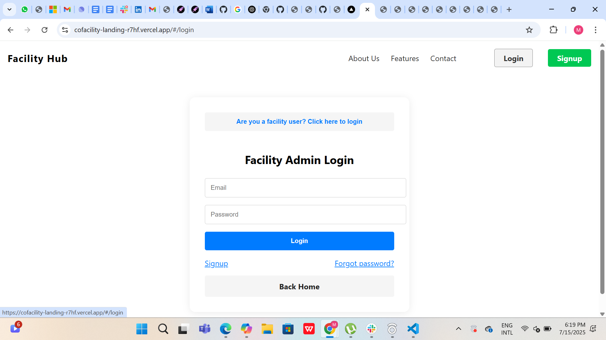
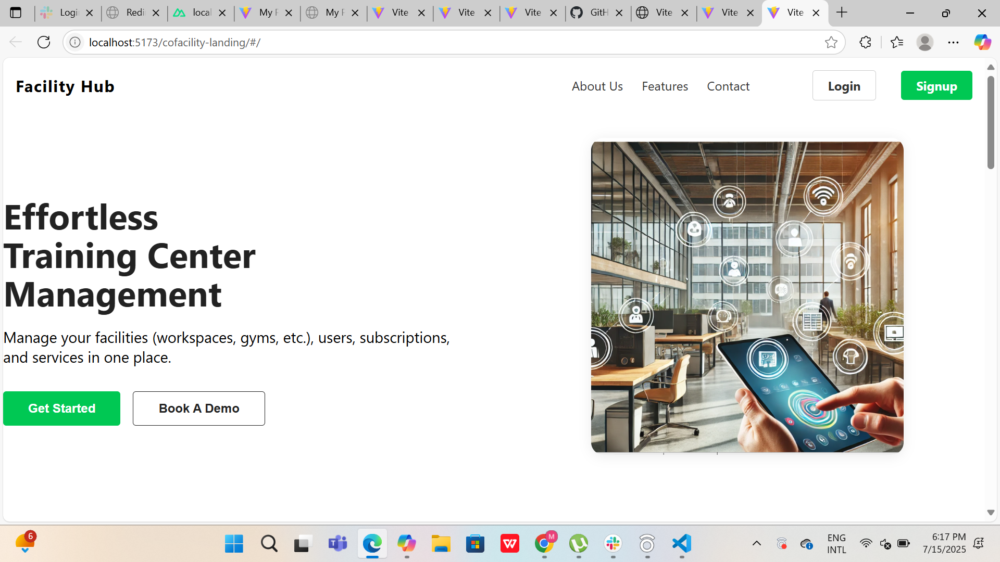

# CoFacility Landing 🚀

A modern, responsive landing page for **CoFacility**, built with **Vue 3**, **Vite**, and **Tailwind CSS**. Designed to showcase services, capture leads, and deliver a sleek user experience across devices.

---

## ✨ Features

- ⚡️ Fast performance with Vite
- 📱 Mobile-first responsive design
- 🎨 Tailwind-powered styling
- 🧩 Vue 3 component architecture
- 🔍 SEO-friendly structure
- 📤 Ready for deployment on Netlify or Vercel

---

## 🛠 Tech Stack

| Technology     | Role                          |
|----------------|-------------------------------|
| Vue 3          | Frontend framework            |
| Vite           | Build tool and dev server     |
| Tailwind CSS   | Utility-first CSS styling     |

---

## 📦 Project Structure
cofacility-landing/ ├── public/           # Static assets ├── src/ │   ├── assets/       # Images and icons │   ├── components/   # Reusable UI components │   ├── views/        # Page views │   └── App.vue       # Root component ├── index.html        # Entry HTML ├── vite.config.js    # Vite configuratio

---

## ⚙️ Getting Started

### Install dependencies

```bash
npm install
npm run dev
npm run build
Got it, Mercy! I reviewed your existing README for cofacility-landing, and you’ve got a solid foundation—nice job including the tech stack and setup instructions. Let’s elevate it with a more polished structure, clearer branding, and some recruiter-friendly touches.

🔧 Improved README.md (Refined Version)
# CoFacility Landing 🚀

A modern, responsive landing page for **CoFacility**, built with **Vue 3**, **Vite**, and **Tailwind CSS**. Designed to showcase services, capture leads, and deliver a sleek user experience across devices.

---

## ✨ Features

- ⚡️ Fast performance with Vite
- 📱 Mobile-first responsive design
- 🎨 Tailwind-powered styling
- 🧩 Vue 3 component architecture
- 🔍 SEO-friendly structure
- 📤 Ready for deployment on Netlify or Vercel

---

## 🛠 Tech Stack

| Technology     | Role                          |
|----------------|-------------------------------|
| Vue 3          | Frontend framework            |
| Vite           | Build tool and dev server     |
| Tailwind CSS   | Utility-first CSS styling     |

---

## 📦 Project Structure


cofacility-landing/ ├── public/           # Static assets ├── src/ │   ├── assets/       # Images and icons │   ├── components/   # Reusable UI components │   ├── views/        # Page views │   └── App.vue       # Root component ├── index.html        # Entry HTML ├── vite.config.js    # Vite configuration

---

## ⚙️ Getting Started

### Install dependencies

```bash
npm install


Run development server
npm run dev


Build for production
npm run build


📸 Screenshots





📌 Roadmap
- [ ] Add contact form integration
- [ ] Add animations and transitions
- [ ] Improve accessibility
- [ ] Deploy to Netlify with custom domain

👤 Author
Mercy Chepngeno
https://github.com/chep-collab

📄 License
MIT

